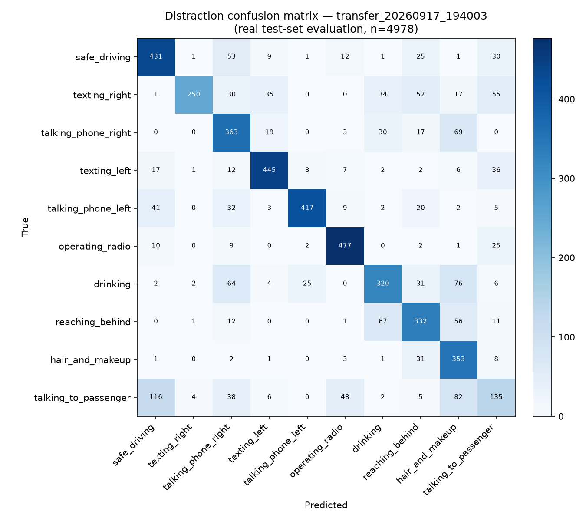

# Distraction evaluation report — `transfer_20260917_194003`

Real held-out test-set evaluation (never re-run/estimated for this report; source: `experiments/distraction/transfer_20260917_194003_test_eval.json`).

- Test set size: 4978 images
- Accuracy: 0.7077
- Balanced accuracy: 0.7026
- Macro F1: 0.6967
- Weighted F1: 0.7049
- Inference speed (CPU): 169.7 FPS

## Per-class metrics

| Class | Name | Precision | Recall | F1 | Support |
|---|---|---|---|---|---|
| c0 | safe_driving | 0.696 | 0.764 | 0.729 | 564 |
| c1 | texting_right | 0.965 | 0.527 | 0.682 | 474 |
| c2 | talking_phone_right | 0.590 | 0.725 | 0.651 | 501 |
| c3 | texting_left | 0.852 | 0.830 | 0.841 | 536 |
| c4 | talking_phone_left | 0.921 | 0.785 | 0.848 | 531 |
| c5 | operating_radio | 0.852 | 0.907 | 0.878 | 526 |
| c6 | drinking | 0.697 | 0.604 | 0.647 | 530 |
| c7 | reaching_behind | 0.642 | 0.692 | 0.666 | 480 |
| c8 | hair_and_makeup | 0.532 | 0.882 | 0.664 | 400 |
| c9 | talking_to_passenger | 0.434 | 0.310 | 0.361 | 436 |

