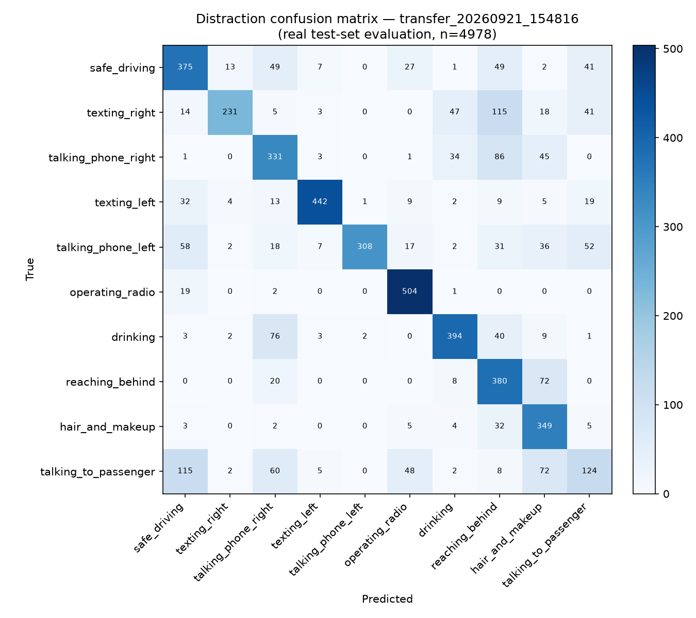

# Distraction evaluation report — `transfer_20260921_154816`

Real held-out test-set evaluation (never re-run/estimated for this report; source: `experiments/distraction/transfer_20260921_154816_test_eval.json`).

- Test set size: 4978 images
- Accuracy: 0.6906
- Balanced accuracy: 0.6868
- Macro F1: 0.6804
- Weighted F1: 0.6877
- Inference speed (CPU): 125.7 FPS

## Per-class metrics

| Class | Name | Precision | Recall | F1 | Support |
|---|---|---|---|---|---|
| c0 | safe_driving | 0.605 | 0.665 | 0.633 | 564 |
| c1 | texting_right | 0.909 | 0.487 | 0.635 | 474 |
| c2 | talking_phone_right | 0.575 | 0.661 | 0.615 | 501 |
| c3 | texting_left | 0.940 | 0.825 | 0.879 | 536 |
| c4 | talking_phone_left | 0.990 | 0.580 | 0.732 | 531 |
| c5 | operating_radio | 0.825 | 0.958 | 0.887 | 526 |
| c6 | drinking | 0.796 | 0.743 | 0.769 | 530 |
| c7 | reaching_behind | 0.507 | 0.792 | 0.618 | 480 |
| c8 | hair_and_makeup | 0.574 | 0.873 | 0.692 | 400 |
| c9 | talking_to_passenger | 0.438 | 0.284 | 0.345 | 436 |

